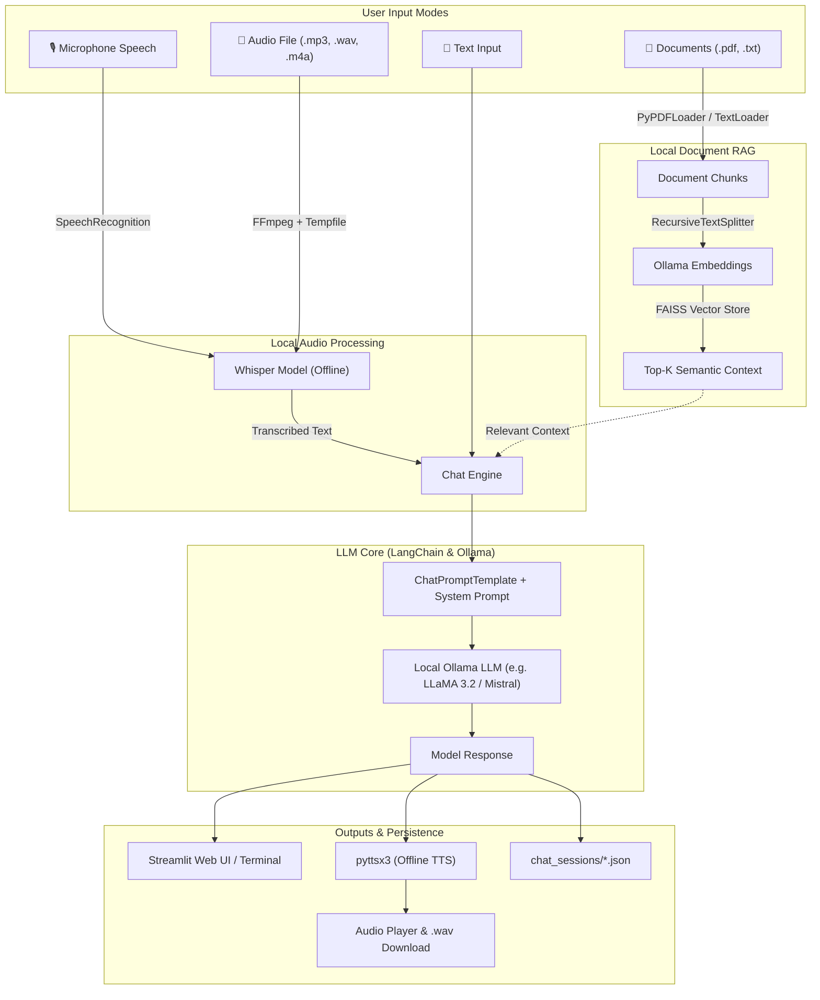

# 🛡️ Offline AI Assistant

[](https://www.python.org/)
[](https://streamlit.io/)
[](https://www.langchain.com/)
[](https://ollama.com/)
[](https://github.com/openai/whisper)
[](https://github.com/facebookresearch/faiss)
[](#-security--privacy)

An air-gapped, privacy-first personal AI assistant featuring **local LLM inference**, **RAG-based Document Q&A**, **offline speech-to-text (STT)**, and **text-to-speech (TTS)**. Designed to run completely offline on your own hardware without transmitting data to external servers or cloud APIs.

---

## 📑 Table of Contents

- [Key Features](#-key-features)
- [Architecture](#-architecture)
- [Tech Stack](#-tech-stack)
- [Prerequisites](#-prerequisites)
- [Installation & Setup](#-installation--setup)
- [Usage Guide](#-usage-guide)
  - [1. Streamlit Web Interface](#1-streamlit-web-interface-uichatpy)
  - [2. Terminal / CLI Interface](#2-terminal--cli-interface-terminalchatpy)
- [Detailed Capabilities](#-detailed-capabilities)
  - [Document Q&A (RAG)](#-document-qa-rag)
  - [Offline Voice Processing (STT & TTS)](#-offline-voice-processing-stt--tts)
  - [Persistent Chat Sessions](#-persistent-chat-sessions)
- [Project Structure](#-project-structure)
- [Security & Privacy](#-security--privacy)
- [Troubleshooting](#-troubleshooting)
- [License](#-license)

---

## ✨ Key Features

- 🔒 **100% Offline & Air-Gapped**: Runs entirely on local compute. Zero telemetry, zero external API keys, zero cloud exposure.
- 🧠 **Local LLM Inference**: Powered by [Ollama](https://ollama.com) supporting models such as `llama3.2`, `mistral:7b`, and other GGUF models. Auto-detects installed models.
- 📄 **Document Q&A (Local RAG)**: Upload PDF or TXT files. Documents are automatically chunked, embedded locally, and indexed with **FAISS** for fast semantic retrieval.
- 🎙️ **Offline Speech-to-Text (STT)**:
  - **Live Microphone Input**: Real-time microphone listening transcribed locally with **OpenAI Whisper**.
  - **Audio File Transcription**: Upload `.mp3`, `.wav`, or `.m4a` files for offline transcription and instant chat querying.
  - **Transcript Export**: Download transcription files as text with a single click.
- 🔊 **Offline Text-to-Speech (TTS)**:
  - Natural speech synthesis via **pyttsx3** executed in a background thread to ensure zero UI freezing.
  - Generates downloadable `.wav` audio files directly within the chat interface.
- 💾 **Session History Management**: Automatically persists chat sessions to disk (`chat_sessions/*.json`). Switch, reload, or delete past conversations anytime.
- 🎨 **Modern Streamlit Interface & CLI**: Clean custom UI with centered loading animations, sticky bottom chat bar, model selector, personality prompt tuning, and an alternative lightweight terminal chat mode.

---

## 🏗 Architecture



---

## 🛠 Tech Stack

| Layer | Technology | Purpose |
| :--- | :--- | :--- |
| **User Interface** | [Streamlit](https://streamlit.io/) | Interactive web UI with session history & custom styles |
| **LLM Orchestration** | [LangChain](https://www.langchain.com/) (`langchain-core`, `langchain-ollama`, `langchain-community`) | Prompt templates, chat memory, and retrieval pipelines |
| **Local LLM Engine** | [Ollama](https://ollama.com/) | High-performance offline LLM inference |
| **Vector Database** | [FAISS](https://github.com/facebookresearch/faiss) (`faiss-cpu`) | Local similarity search for document chunks |
| **Document Loaders** | `PyPDFLoader`, `TextLoader` | Parsing `.pdf` and `.txt` documents |
| **Speech-to-Text** | [OpenAI Whisper](https://github.com/openai/whisper) & `SpeechRecognition` | Offline voice transcription from mic and audio files |
| **Text-to-Speech** | [pyttsx3](https://pyttsx3.readthedocs.io/) | Offline local audio voice synthesis |
| **Audio Processing** | [FFmpeg](https://ffmpeg.org/) & `PyAudio` | Audio format conversion and microphone recording |

---

## 📋 Prerequisites

Before running the application, ensure the following tools are installed on your system:

### 1. Python 3.10+
Verify your Python installation:
```bash
python3 --version
```

### 2. Ollama
Install Ollama from [ollama.com](https://ollama.com/) and start the daemon:
```bash
ollama serve
```
Pull your preferred models (at least one is required):
```bash
# Recommended lightweight model
ollama pull llama3.2

# Alternatively, Mistral 7B
ollama pull mistral:7b
```

### 3. System Audio & Media Dependencies (FFmpeg & PortAudio)
Whisper audio conversion and PyAudio microphone capture require system libraries:

- **macOS (Homebrew)**:
  ```bash
  brew install ffmpeg portaudio
  ```
- **Ubuntu / Debian**:
  ```bash
  sudo apt-get update
  sudo apt-get install -y ffmpeg portaudio19-dev python3-pyaudio
  ```
- **Windows (Chocolatey / Scoop)**:
  ```powershell
  choco install ffmpeg
  ```

---

## 🚀 Installation & Setup

### 1. Clone the Repository
```bash
git clone https://github.com/Siddhi0808/OFFLINE-AI-ASSISTANT.git
cd OFFLINE-AI-ASSISTANT
```

### 2. Create and Activate a Virtual Environment
```bash
# macOS / Linux
python3 -m venv venv
source venv/bin/activate

# Windows
python -m venv venv
.\venv\Scripts\activate
```

### 3. Install Dependencies
```bash
pip install --upgrade pip
pip install -r requirements.txt
```

> **Note:** When first transcribing audio, the `whisper` base model will automatically download to `./models/` and remain cached for permanent offline reuse.

---

## 💻 Usage Guide

### 1. Streamlit Web Interface (`UIChat.py`)
Run the full-featured graphical interface:

```bash
streamlit run UIChat.py
```

Open your browser at `http://localhost:8501`.

#### What you can do in the Web UI:
- **Chat & Interact**: Ask general questions to your local model.
- **Upload Documents**: Use the **"📄 Upload"** widget to attach PDFs or text files. The assistant will reference document content when answering.
- **Microphone Voice Input**: Toggle **"🎙 Voice Input"** in the sidebar, click **"🎤 Press & Speak"**, and talk. Your speech is transcribed locally and placed into the prompt.
- **Upload Audio Files**: Upload `.mp3`, `.wav`, or `.m4a` files via **"🎙 Upload Audio"** for automated transcription and querying.
- **Voice Output**: Toggle **"🔊 Voice Output"** to hear spoken responses and download generated `.wav` audio.
- **Custom Personality**: Customize the system prompt in the sidebar (e.g. *"You are a concise cybersecurity analyst"*).
- **Session Switcher**: Review, switch between, or delete past conversations from the sidebar.

---

### 2. Terminal / CLI Interface (`TerminalChat.py`)
For headless servers, SSH sessions, or fast terminal interactions:

```bash
python TerminalChat.py
```

- Type your queries directly in the terminal.
- Type `exit` or `quit` to end the session.
- Uses `llama3.2` by default with in-memory conversational history.

---

## 🔍 Detailed Capabilities

### 📄 Document Q&A (RAG)
When a document is uploaded:
1. It is extracted using `PyPDFLoader` or `TextLoader`.
2. Content is split into chunks of 1000 characters with 100-character overlap using `RecursiveCharacterTextSplitter`.
3. Embeddings are created via `OllamaEmbeddings(model=selected_model)`.
4. Stored in an ephemeral local **FAISS** vector store.
5. Top relevant chunks are automatically injected into the LLM context window when you submit questions.

### 🎙️ Offline Voice Processing (STT & TTS)
- **STT (Speech-to-Text)**:
  Uses the local OpenAI Whisper `base` model. Audio is processed directly in system memory and temporary files without external API calls.
- **TTS (Text-to-Speech)**:
  Uses `pyttsx3`, interfacing with native OS speech synthesizers (NSSpeechSynthesizer on macOS, SAPI5 on Windows, eSpeak on Linux). Non-blocking background thread execution keeps the UI responsive.

### 💾 Persistent Chat Sessions
- All conversations are serialized and saved in JSON format under `chat_sessions/<session-id>.json`.
- Each record stores the chat title, creation timestamp, and message history.
- Sessions can be resumed across restarts.

---

## 📂 Project Structure

```plaintext
OFFLINE-AI-ASSISTANT/
├── chat_sessions/         # Stored chat sessions in JSON format
│   └── <uuid>.json
├── models/                # Local cache directory for offline Whisper weights
├── TerminalChat.py        # Lightweight CLI terminal chat application
├── UIChat.py              # Feature-rich Streamlit web application
├── requirements.txt       # Project Python dependencies
└── README.md              # Project documentation
```

---

## 🔐 Security & Privacy

This application was engineered with a strict **local-first** security mindset:

- **Zero Cloud Leakage**: No telemetry, analytics, or external API calls are made.
- **Air-Gap Compatible**: Can run in secure, isolated environments without an active Internet connection once dependencies and models are downloaded.
- **Local Data Storage**: Chat history and index vectors are kept entirely within local storage and memory.

---

## ❓ Troubleshooting

### 1. `Local Ollama: Run ollama serve offline`
- **Cause**: The Ollama background service is not running or unreachable.
- **Fix**: Open a terminal and run:
  ```bash
  ollama serve
  ```
  Ensure Ollama is accessible at `http://localhost:11434`.

### 2. `FFmpeg is not installed or not in PATH`
- **Cause**: OpenAI Whisper requires `ffmpeg` to process audio files.
- **Fix**:
  - macOS: `brew install ffmpeg`
  - Linux: `sudo apt install ffmpeg`
  - Windows: Download from [ffmpeg.org](https://ffmpeg.org/download.html) and add `ffmpeg/bin` to your system `PATH`.

### 3. PyAudio / Microphone Recognition Errors
- **Cause**: Missing PortAudio development headers.
- **Fix**:
  - macOS: `brew install portaudio && pip install pyaudio`
  - Ubuntu/Debian: `sudo apt-get install portaudio19-dev && pip install pyaudio`

### 4. Out of Memory / Slow Inference
- If running on lower-spec hardware, choose smaller models such as `llama3.2:1b` or `llama3.2:3b`.
- Run `ollama run llama3.2:1b` to test standalone model performance on your machine.

---

## 📄 License

This project is licensed under the [MIT License](LICENSE) — feel free to use, modify, and distribute it for personal and commercial projects.
