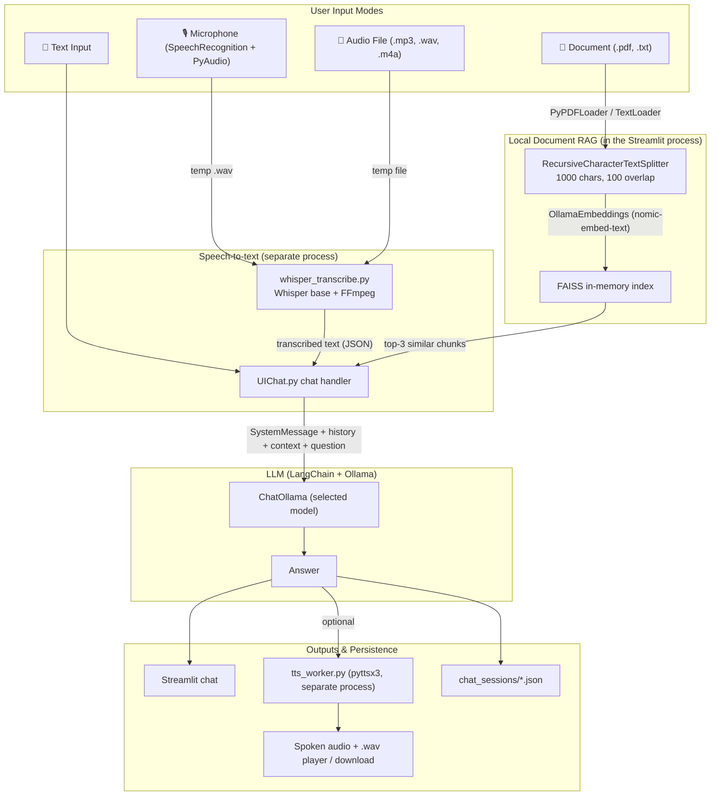

# 🛡️ Offline AI Assistant

[](https://www.python.org/)
[](https://streamlit.io/)
[](https://www.langchain.com/)
[](https://ollama.com/)
[](https://github.com/openai/whisper)
[](https://github.com/facebookresearch/faiss)

A privacy-first personal AI assistant that runs on your own machine: **local LLM chat**, **RAG-based Document Q&A**, **offline speech-to-text (STT)** and **text-to-speech (TTS)**. After the one-time download of dependencies and models, it needs no internet connection and sends no data to cloud APIs.

---

## 📑 Table of Contents

- [Key Features](#-key-features)
- [Architecture](#-architecture)
- [Tech Stack](#-tech-stack)
- [Prerequisites](#-prerequisites)
- [Installation & Setup](#-installation--setup)
- [Usage Guide](#-usage-guide)
- [Detailed Capabilities](#-detailed-capabilities)
- [Project Structure](#-project-structure)
- [Testing](#-testing)
- [Evaluation](#-evaluation)
- [Security & Privacy](#-security--privacy)
- [Known Limitations](#-known-limitations)
- [Troubleshooting](#-troubleshooting)
- [License](#-license)

---

## ✨ Key Features

- 🔒 **Local-only processing**: chat, embeddings, transcription and speech synthesis all run on your machine. The only network traffic is to the local Ollama server on `localhost:11434`. Streamlit's anonymous usage statistics are switched off in `.streamlit/config.toml`.
- 🧠 **Local LLM chat**: powered by [Ollama](https://ollama.com) (e.g. `llama3.2`). The model selector lists the chat-capable models installed locally (embedding-only models are filtered out).
- 📄 **Document Q&A (local RAG)**: upload a PDF or TXT file. It is split into chunks, embedded locally with `nomic-embed-text`, and indexed in an in-memory **FAISS** index. The 3 most similar chunks are added to every question while the document is loaded.
- 🎙️ **Offline speech-to-text** with OpenAI's open-source **Whisper** (`base` model):
  - **Microphone input**: record a question and transcribe it locally (the transcript can be downloaded as `.txt`).
  - **Audio files**: upload `.mp3`, `.wav` or `.m4a` and the transcript is sent as your question.
- 🔊 **Offline text-to-speech** with **pyttsx3** (the operating system's built-in voices): answers can be read aloud, and a `.wav` file is offered for playback and download.
- 💾 **Chat history**: conversations are saved to `chat_sessions/<id>.json` and can be reopened or deleted from the sidebar.
- 🖥️ **Two interfaces**: a Streamlit web app (`UIChat.py`) and a minimal terminal chat (`TerminalChat.py`).

---

## 🏗 Architecture


```mermaid
flowchart TD
    subgraph Inputs["User Input Modes"]
        A1["💬 Text Input"]
        A2["🎙️ Microphone (SpeechRecognition + PyAudio)"]
        A3["📁 Audio File (.mp3, .wav, .m4a)"]
        A4["📄 Document (.pdf, .txt)"]
    end

    subgraph SpeechLayer["Speech-to-text (separate process)"]
        A2 -->|temp .wav| W["whisper_transcribe.py<br/>Whisper base + FFmpeg"]
        A3 -->|temp file| W
        W -->|"transcribed text (JSON)"| B["UIChat.py chat handler"]
    end

    subgraph RAGLayer["Local Document RAG (in the Streamlit process)"]
        A4 -->|"PyPDFLoader / TextLoader"| D1["RecursiveCharacterTextSplitter<br/>1000 chars, 100 overlap"]
        D1 -->|"OllamaEmbeddings (nomic-embed-text)"| D2["FAISS in-memory index"]
        D2 -->|"top-3 similar chunks"| B
    end

    A1 --> B

    subgraph CoreEngine["LLM (LangChain + Ollama)"]
        B -->|"SystemMessage + history + context + question"| LLM["ChatOllama (selected model)"]
        LLM --> RESP["Answer"]
    end

    subgraph Outputs["Outputs & Persistence"]
        RESP --> UI["Streamlit chat"]
        RESP -->|optional| TTS["tts_worker.py (pyttsx3, separate process)"]
        TTS --> AUD["Spoken audio + .wav player / download"]
        RESP --> SESS["chat_sessions/*.json"]
    end
```

Whisper and pyttsx3 run in short-lived **child processes** rather than inside the Streamlit process:
- **Whisper**: PyTorch (used by Whisper) and FAISS each ship their own OpenMP runtime. Loading both into one process aborts or deadlocks it on macOS.
- **pyttsx3**: Streamlit runs the app in a worker thread, and the macOS speech driver only produces audio on a process's main thread.

`TerminalChat.py` is a separate, simpler client: `ChatPromptTemplate` + `MessagesPlaceholder` + `RunnableWithMessageHistory` around `ChatOllama("llama3.2")`, with in-memory history only.

---

## 🛠 Tech Stack

| Layer | Technology | Purpose |
| :--- | :--- | :--- |
| **User Interface** | [Streamlit](https://streamlit.io/) | Web UI, session state, file uploads, chat widgets |
| **LLM Orchestration** | [LangChain](https://www.langchain.com/) (`langchain-core`, `langchain-ollama`, `langchain-community`, `langchain-text-splitters`) | Message types, chat history, document loaders, text splitting, FAISS wrapper; prompt templates in the CLI |
| **Local LLM Engine** | [Ollama](https://ollama.com/) | Local inference for the chat model and the embedding model |
| **Vector Index** | [FAISS](https://github.com/facebookresearch/faiss) (`faiss-cpu`) | In-memory similarity search over document chunks |
| **Document Loaders** | `PyPDFLoader` (pypdf), `TextLoader` | Parsing `.pdf` and `.txt` files |
| **Speech-to-Text** | [OpenAI Whisper](https://github.com/openai/whisper) (`base`), `SpeechRecognition` + `PyAudio` | Local transcription; microphone capture |
| **Text-to-Speech** | [pyttsx3](https://pyttsx3.readthedocs.io/) | Offline speech using the OS voices |
| **Audio Processing** | [FFmpeg](https://ffmpeg.org/) | Audio decoding for Whisper; converting TTS output to WAV |

---

## 📋 Prerequisites

Tested on **macOS with Python 3.13.5**. The Linux/Windows commands below are provided for convenience but have not been verified.

### 1. Python 3
```bash
python3 --version
```

### 2. Ollama + models
Install Ollama from [ollama.com](https://ollama.com/), make sure it is running (`ollama serve`), then pull a chat model **and** the embedding model used for Document Q&A:
```bash
ollama pull llama3.2
ollama pull nomic-embed-text
```

### 3. FFmpeg & PortAudio
Whisper needs `ffmpeg` to decode audio, and PyAudio needs PortAudio for microphone capture.

- **macOS (Homebrew)**: `brew install ffmpeg portaudio`
- **Ubuntu / Debian**: `sudo apt-get install -y ffmpeg portaudio19-dev`
- **Windows**: `choco install ffmpeg`

---

## 🚀 Installation & Setup

```bash
git clone https://github.com/Siddhi0808/OFFLINE-AI-ASSISTANT.git
cd OFFLINE-AI-ASSISTANT

python3 -m venv venv
source venv/bin/activate        # Windows: .\venv\Scripts\activate

pip install --upgrade pip
pip install -r requirements.txt
```

`requirements.txt` lists the direct dependencies, pinned to the versions this project was verified with. PyTorch and the other transitive dependencies are installed automatically.

> **First transcription:** Whisper downloads its `base` model (~139 MB) into `./models/` the first time it is used. This is the only step that needs internet; afterwards the weights are loaded from disk.

---

## 💻 Usage Guide

### 1. Streamlit Web Interface (`UIChat.py`)

```bash
streamlit run UIChat.py
```

Open `http://localhost:8501`.

- **Chat**: type in the input bar pinned to the bottom of the page.
- **Model**: choose any locally installed chat model in the sidebar.
- **System Prompt**: edit the assistant's instructions in the sidebar.
- **Upload a document** (**📄 Upload**): PDF/TXT. While it stays uploaded, its most relevant chunks are added to every question.
- **Upload audio** (**🎙 Upload Audio**): `.mp3`, `.wav`, `.m4a`. The transcript is sent as your question.
- **Voice Input** toggle → **🎤 Press & Speak**: records from the microphone, then transcribes with Whisper.
- **Voice Output** toggle: answers are spoken aloud and offered as a `.wav` player/download.
- **Chat History**: open or delete saved conversations in the sidebar.

### 2. Terminal Interface (`TerminalChat.py`)

```bash
python TerminalChat.py
```

- Uses `llama3.2` with in-memory conversation history (not saved to disk).
- Type `exit` or `quit` (or press Ctrl-D / Ctrl-C) to leave.

---

## 🔍 Detailed Capabilities

### 📄 Document Q&A (RAG)
1. The uploaded file is written to a temporary file and loaded with `PyPDFLoader` (PDF) or `TextLoader` (UTF-8 text).
2. `RecursiveCharacterTextSplitter` splits it into chunks of up to 1000 characters with 100 characters of overlap.
3. Each chunk is embedded with `OllamaEmbeddings(model="nomic-embed-text")`.
4. The vectors go into an in-memory FAISS index (exact L2 search), kept in Streamlit session state. Nothing is written to disk.
5. For each question, the 3 nearest chunks are put in front of the question as `Document Context`.

The index is rebuilt when a different file is uploaded and dropped when the file is removed.

### 🎙️ Speech-to-Text
`whisper_transcribe.py` loads the Whisper `base` model from `./models/` and transcribes the given file, printing `{"text": ...}`. `UIChat.py` runs it as a subprocess for both microphone recordings and uploaded files.

### 🔊 Text-to-Speech
`tts_worker.py` uses pyttsx3, which drives the OS speech engine (NSSpeechSynthesizer on macOS, SAPI5 on Windows, eSpeak on Linux). When Voice Output is on, the app runs it once to save the answer to a file, which it converts to WAV with FFmpeg if needed (macOS writes AIFF), and once more in the background to speak the answer aloud.

### 💾 Chat Sessions
Each conversation is saved as `chat_sessions/<uuid>.json` with its title (first four words of the first message), the time of the **last update**, and the list of messages (`human` / `ai`). Sessions can be reopened after a restart.

---

## 📂 Project Structure

```plaintext
OFFLINE-AI-ASSISTANT/
├── UIChat.py               # Streamlit web app (chat, RAG, voice, session history)
├── TerminalChat.py         # Minimal terminal chat client
├── rag.py                  # Document Q&A pipeline (chunking, embeddings, FAISS, prompt), shared by app + eval
├── whisper_transcribe.py   # Speech-to-text worker (run as a subprocess by UIChat.py)
├── tts_worker.py           # Text-to-speech worker (run as a subprocess by UIChat.py)
├── tests/                  # unittest suite (Streamlit AppTest, subprocess and unit tests)
├── eval/                   # RAG evaluation: 3 documents, 48 labelled questions, scripts, results
├── .streamlit/config.toml  # Disables Streamlit usage statistics
├── requirements.txt        # Pinned direct dependencies
├── LICENSE
├── chat_sessions/          # Saved conversations (created at runtime, git-ignored)
└── models/                 # Cached Whisper weights (created at runtime, git-ignored)
```

---

## 🧪 Testing

```bash
python -m unittest discover -s tests -v
```

The suite covers:
- **UI**, driven headlessly with Streamlit's `AppTest`: the app renders, embedding-only models are excluded from the chat model list, a chat round trip is saved to disk, an LLM failure shows the fallback message without storing it in history, saved sessions reload, and corrupt session files are skipped.
- **Speech workers**: TTS writes real audio; Whisper transcribes a spoken clip (macOS `say`) and fails cleanly on a missing file.
- **Terminal client**: clean exit on end-of-input, blank lines ignored, and multi-turn memory.
- **Evaluation helpers** (`tests/test_eval_helpers.py`): the answer grader, the context filter and the cutoff tuner.

Tests that need a running Ollama server, the `llama3.2` model or cached Whisper weights are skipped automatically when those are missing. Document upload (RAG) is not covered by the automated tests, because `AppTest` cannot drive file uploads; it was verified manually in the browser.

---

## 📊 Evaluation

`eval/` measures the document Q&A pipeline in `rag.py` on a small labelled set:
- **Documents:** 3 fictional documents written for this evaluation (an engineering handbook, an HR handbook and a water-quality report), so the model cannot answer from its training data.
- **Questions:** 48 in total. 36 are about the documents, each labelled with the exact evidence sentence and the expected answer terms. 12 are unrelated general-knowledge questions asked while a document is loaded. A fixed 50/50 dev/test split is used.

```bash
python eval/run_eval.py        # retrieval metrics + answers at temperature 0 (~20 min)
python eval/sampling_check.py  # answers with the app's default sampling, unrelated questions x5
```

**Retrieval** (36 document questions, top-3 chunks of 1000 characters): Hit@3 **100%** (36/36), Hit@1 **77.8%**, MRR@3 **0.87**.

**Relevance cutoff experiment.** A distance cutoff (keep only chunks with cosine similarity ≥ 0.543) was tuned on the dev split, then measured:

| | No cutoff (app default) | With cutoff |
| :--- | :--- | :--- |
| Held-out test, temperature 0: document questions correct | 100% (18/18) | 88.9% (16/18) |
| Held-out test, temperature 0: unrelated questions correct | 100% (6/6) | 100% (6/6) |
| Held-out test: unrelated replies that talk about the document | 66.7% | 0% |
| Default sampling, all 48 questions: unrelated questions correct (×5 runs) | 93.3% (56/60) | 98.3% (59/60) |
| Default sampling: document questions correct | 100% (36/36) | 94.4% (34/36) |

The cutoff stops document text from leaking into unrelated questions. Without it, 4 of 60 replies refused to answer a general question because a document was loaded. However, it also discarded the evidence for 2 document questions, so the app **keeps the cutoff disabled** (`rag.select_context` is called without a limit). The set is small (one test question ≈ 5.6 points), so these numbers describe this benchmark only.

---

## 🔐 Security & Privacy

- **No cloud APIs**: model inference, embeddings, transcription and speech synthesis all run locally.
- **Telemetry off**: Streamlit's default anonymous usage statistics are disabled in `.streamlit/config.toml`.
- **Offline after setup**: once the Python packages, Ollama models and Whisper weights are downloaded, no internet connection is needed.
- **Plaintext storage**: chat history is stored **unencrypted** as JSON in `chat_sessions/`. Protect that folder if your conversations are sensitive.
- **No authentication**: the Streamlit server has no login. Streamlit listens on all network interfaces by default, so anyone on your network who can reach port 8501 can use the app and see the saved chats. Use `streamlit run UIChat.py --server.address localhost` to restrict it to your machine.

---

## ⚠️ Known Limitations

- While a document is loaded, its top-3 chunks are added to **every** question, even unrelated ones. In the evaluation this made 4 of 60 replies to general questions refuse to answer; a relevance cutoff fixed that but cost accuracy on document questions (see [Evaluation](#-evaluation)).
- Only one document can be indexed at a time, and the index lives in memory (it is rebuilt after a restart).
- Each transcription starts a new Whisper process, which adds a few seconds of model-loading time.
- Scanned PDFs without a text layer cannot be indexed (no OCR).

---

## ❓ Troubleshooting

| Symptom | Fix |
| :--- | :--- |
| Sidebar shows `🟠 Local Ollama: Run ollama serve offline` | Start Ollama (`ollama serve`) and make sure `http://localhost:11434` is reachable. |
| `Could not index document … ollama pull nomic-embed-text` | Install the embedding model: `ollama pull nomic-embed-text`. |
| `FFmpeg is not installed or not in PATH` | Install FFmpeg (`brew install ffmpeg` / `sudo apt install ffmpeg`). |
| PyAudio / microphone errors | Install PortAudio (`brew install portaudio` / `sudo apt-get install portaudio19-dev`), then `pip install pyaudio`. |
| Slow answers / out of memory | Use a smaller model such as `llama3.2:1b`. |

---

## 📄 License

This project is licensed under the [MIT License](LICENSE).
